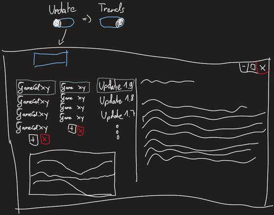

# Steam Newsletter  
**Projektgruppe:** Luis B.,  Jonas M.   
**Klasse:** 2AHIF  
**Jahr:** 2025  
**Betreuer:** Lukas Diem, David Bechtold

---

## 📌 Kurzbeschreibung

Der *Steam Newsletter* ist eine Desktop-Applikation, die Steam-Nutzer über aktuelle Updates von Games aus ihrer Library informiert. Zudem ist es möglich, sich bald erscheinende Spiele, anzeigen zu lassen.   
Die App besteht aus zwei Hauptansichten ("Pages"):

- **Update/Newsletter-Page:** Benutzer sehen neue Updates (z. B. Patches, DLCs) & News der Games.
- **Trending Releases-Page:** Zeigt neue oder bald erscheinende Spiele an, inklusive Filtermöglichkeiten.

Die App nutzt die Steam Web API & die RAWG API.

---

## 📷 Collage (Screenshots)

*(Hier zwei Screenshots einfügen – z. B. von der Update-Seite und der Trending-Page)*

---

## 📦 Relevanter Codeausschnitt

```csharp
foreach (var game in selectedGames)
{
    var updates = steamAPI.GetUpdates(game.Id);
    if (updates.HasNew)
    {
        NotifyUser(updates);
        DisplayUpdateDetails(updates);
    }
}
```

---

## 📅 Projektzeitplan

| Datum       | Aufgabe (Zusammenfassung)                                        | Bearbeiter | Status |
|-------------|------------------------------------------------------------------|------------|--------|
| 30.04.2025  | Projektinitialisierung, erstes Setup                             | Jonas      | ✅      |
| 07.05.2025  | Weitere Strukturierung, Grunddateien                             | Jonas      | ✅      |
| 13.05.2025  | Basisklassen für die Spiellogik erstellt                         | Jonas      | ✅      |
| 14.05.2025  | Commit-Plan & Struktur dokumentiert                              | Luis       | ✅      |
| 28.05.2025  | Grundidee verschriftlicht, GUI-Skizze                            | Luis       | ✅      |
| 03.06.2025  | Steam-Library + GameCollection implementiert, Commit-Plan aktualisiert | Luis       | ✅      |
| 03.06.2025  | JSON-Dateien vorbereitet, Files gemerged                         | Jonas      | ✅      |
| 04.06.2025  | MainWindow zu Pages umgebaut, lib-Struktur angelegt             | Jonas      | ✅      |
| 04.06.2025  | GameCollection View erstellt                                     | Luis       | ✅      |
| 08.06.2025  | Trending Games Funktion gestartet                                | Jonas      | ✅      |
| 10.06.2025  | Releases sortiert, Toggle + Ladeprobleme behandelt              | Jonas      | ✅      |
| 10.06.2025  | Spielesammlung visuell umgesetzt                                 | Luis       | ✅      |
| 11.06.2025  | Visual-Update & Steam Account Speicherung                        | Luis       | ✅      |
| 13.06.2025  | Trending-Komponente refactored                                   | Jonas      | ✅      |
| 13.06.2025  | Input Window implementiert                                       | Luis       | ✅      |
| 14.06.2025  | Filters + Game Count in Trending integriert                      | Jonas      | ✅      |
| 14.06.2025  | Autofill API-Key, Merge Vorgang                                  | Luis       | ✅      |
| 15.06.2025  | Gamedetail Window + Anpassungen in Trending                      | Jonas      | ✅      |
| 15.06.2025  | UserDataWindow voll funktionsfähig                               | Luis       | ✅      |
| 16.06.2025  | API-Key manuell eingeben, Input angepasst                        | Jonas      | ✅      |
| 16.06.2025  | Speicher-/Ladefunktion finalisiert, Bugs gefixt, Merge durchgeführt | Luis       | ✅      |

---

## 📋 Lastenheft

### 2.1 Kurzbeschreibung

Auf der **Update/Newsletter-Page** werden Steam-Spiel-Updates dargestellt. Die Nutzer wählen Spiele aus ihrer Bibliothek, um jeweils die letzten News/Updates anzusehen.

Auf der **Trending Releases-Page** kann man, mithilfe von einigen Filtern, sich Spiele anzeigen lassen - standardmäßig im aktuellen Monat erscheinende.

### 2.2 Skizzen
**Update/Newsletter-Page**



**Trending Releases-Page**


### 2.3 Funktionsumfang

#### Must-Haves
- [x] Visuelle Spielanzeige mit Icons und Infos
- [x] Anzeige kommender Game-Releases mit Filtern
- [x] API-Auswertung zu Spiel-Updates
- [x] Feste Auswahl von Spielen für Updates
- [x] Toggle-Button für Seitenwechsel

#### Nice-to-Haves
- [x] Steam-Account-Verknüpfung
- [ ] Auswahl mehrerer Spiele für Updates
- [ ] Systemweite Push-Benachrichtigungen

---

## 📑 Pflichtenheft

### Programmlogik

- **Page 1: Update/Newsletter-Page**  
  Nutzer gibt seine/ihre Steam ID und API Key an. Das Programm zeigt die letzten Updates dieser Spiele.

- **Page 2: Trending-Releases-Page**  
  Abfrage und Anzeige kommender Spiele mit Filtermöglichkeiten (z. B. Platformen, Erscheinungsdatum). 

### Klassenstruktur

- `Game`: Daten eines einzelnen Spiels speichern
- `GameCollection`: Verwaltung und Handling mehrerer Spiele
- `RawgFetchGames`: Statische Klasse zum Abrufen von Spieldaten über die RAWG API
- `RawgFilters`: Enthält Filter- und Parameterwerte für API-Anfragen
- `RawgGame`: Daten eines Spiels mit allen relevanten Eigenschaften aus der API speichern
- `RawgRoot`: Repräsentiert die API-Antwort mit der Liste der Spiele

### Umsetzung & Herausforderungen

- Toggle zwischen Pages anfangs fehleranfällig → refactored
- API-Verbindung mit Try/Catch abgesichert
- GUI responsiv und übersichtlich halten war wichtig

### Tests & Ergebnisse

- **Updates** werden zuverlässig erkannt
- **Trending-Page** reagiert schnell auf Filter
- GUI funktioniert stabil
- Manchmal leicht verzögerte Ladezeiten bei schlechter Internetverbindung

---

## 📘 Anleitung

### Installationsanleitung

- .NET 6 SDK installieren
- Repository klonen:  
  `https://github.com/YoshyRias/SteamNewsletter.git`
- In Visual Studio öffnen, `SteamNewsletter.sln` starten

### Bedienungsanleitung

1. App starten
2. Sich mit SteamID und API Key anmelden
3. In der **Update-Page** auf die eigene library drücken - Spiel auswählen - Updates anschauen
4. Toggle Button oben klicken, um zur **Trending-Page** zu wechseln
5. Einen eigenen RAWG API Key besorgen - per **Get API Key** (bei Anmeldeproblemen das Fragezeichen benutzen)
6. Dann neue Releases entdecken und filtern (Refresh Button um neue Filter anzuwenden)
7. Per Doppelklick auf das Game spezifischere Informationen kriegen

---

## 🐞 Bekannte Bugs

- Trending-Liste lädt gelegentlich langsam 
- Einzelne Spiele zeigen nicht alle Changelogs korrekt an

---

## 🚀 Erweiterungsmöglichkeiten

- Integrierte Benachrichtigungen (System oder Discord)
- Erweiterte Filter (z. B. nach Genres, Bewertungen, ...)
- Speicherung lokaler Updatehistorien

---

## 🔗 Repository

[SteamNewsletter GitHub Repository](https://github.com/YoshyRias/SteamNewsletter.git)