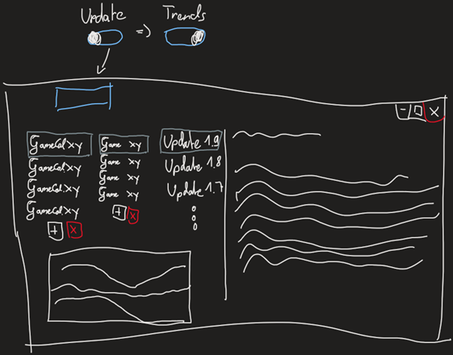
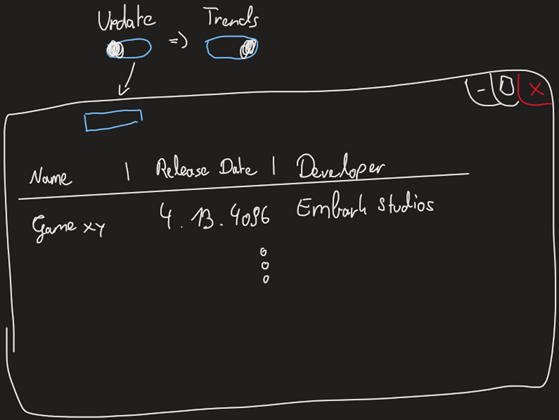
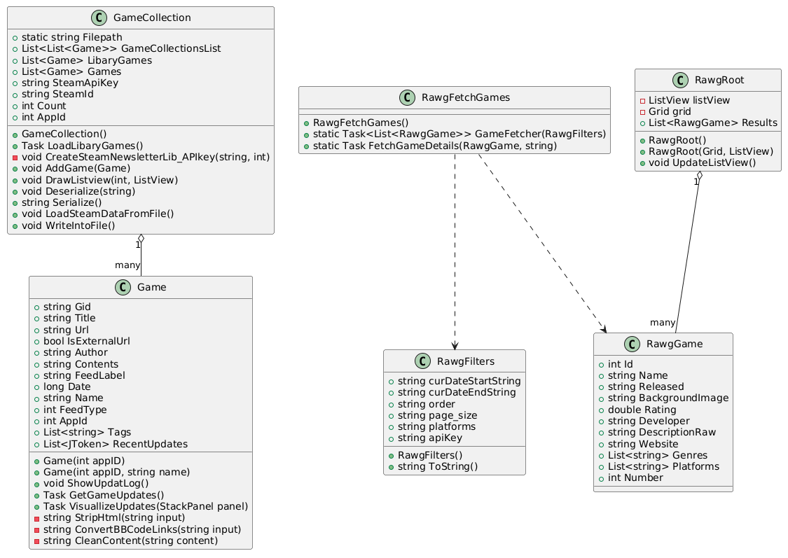

# Steam Newsletter  
**Projektgruppe:** Luis B.,  Jonas M.   
**Klasse:** 2AHIF  
**Jahr:** 2025  
**Betreuer:** Lukas Diem, David Bechtold

---

## 📌 Kurzbeschreibung

Der *Steam Newsletter* ist eine Desktop-Applikation, die Steam-Nutzer über aktuelle Updates von Games aus ihrer Library informiert. Zudem ist es möglich, sich bald erscheinende Spiele, anzeigen zu lassen.   
Die App besteht aus zwei Hauptansichten ("Pages"):

- **Update/Newsletter-Page:** Benutzer sehen neue Updates (z. B. Patches, DLCs) & News der Games.
- **Trending Releases-Page:** Zeigt neue oder bald erscheinende Spiele an, inklusive Filtermöglichkeiten.

Die App nutzt die Steam Web API & die RAWG API.

---

## 📷 Collage (Screenshots)


 


   
---

## 📦 Relevanter Codeausschnitt

```csharp
public async Task LoadLibaryGames()
 {

     string url = $"https://api.steampowered.com/IPlayerService/GetOwnedGames/v1/?key={SteamApiKey}&steamid={SteamId}&include_appinfo=true&include_played_free_games=true";

     using (HttpClient client = new HttpClient())
     {
         HttpResponseMessage response = await client.GetAsync(url);
         string json = await response.Content.ReadAsStringAsync();

         JObject data = JObject.Parse(json);
         var games = data["response"]?["games"];

         List<string> GameDataList = new List<string>();

         if (games != null)
         {
             foreach (JObject game in games)
             {
                 string GameData = ($"{game["name"]},{game["appid"]},{game["playtime_forever"]}");
                 GameDataList.Add(GameData);
                 LibaryGames.Add(new Game(int.Parse(game["appid"].ToString()), game["name"].ToString()));
             }
         }
     }
 }
```
## Inhaltsverzeichnis

- [1. Projektzeitplan](#1-projektzeitplan)
- [2. Lastenheft](#2-lastenheft)
  - [2.1 Kurzbeschreibung](#21-kurzbeschreibung)
  - [2.2 Skizzen](#22-skizzen)
  - [2.3 Funktionsumfang](#23-funktionsumfang)
- [3. Pflichtenheft](#3-pflichtenheft)
  - [3.1 Interner Programmaufbau (Programmlogik)](#31-interner-programmaufbau-programmlogik)
  - [3.2 Umsetzungsdetails](#32-umsetzungsdetails)
  - [3.3 Ergebnisse, Interpretation (Tests)](#33-ergebnisse-interpretation-tests)
- [4. Anleitung](#4-anleitung)
  - [4.1 Installationsanleitung](#41-installationsanleitung)
  - [4.2 Bedienungsanleitung](#42-bedienungsanleitung)
- [5. Bekannte Bugs, Probleme](#5-bekannte-bugs-probleme)
- [6. Erweiterungsmöglichkeiten](#6-erweiterungsmöglichkeiten)
- [7. Repository](#7-repository)
---

## 1. Projektzeitplan

| Datum       | Aufgabe (Zusammenfassung)                                        | Bearbeiter | Status |
|-------------|------------------------------------------------------------------|------------|--------|
| 30.04.2025  | Projektinitialisierung, erstes Setup                             | Jonas      | ✅      |
| 07.05.2025  | Weitere Strukturierung, Grunddateien                             | Jonas      | ✅      |
| 13.05.2025  | Basisklassen für die Spiellogik erstellt                         | Jonas      | ✅      |
| 14.05.2025  | Commit-Plan & Struktur dokumentiert                              | Luis       | ✅      |
| 28.05.2025  | Grundidee verschriftlicht, GUI-Skizze                            | Luis       | ✅      |
| 03.06.2025  | Steam-Library + GameCollection implementiert, Commit-Plan aktualisiert | Luis       | ✅      |
| 03.06.2025  | JSON-Dateien vorbereitet, Files gemerged                         | Jonas      | ✅      |
| 04.06.2025  | MainWindow zu Pages umgebaut, lib-Struktur angelegt             | Jonas      | ✅      |
| 04.06.2025  | GameCollection View erstellt                                     | Luis       | ✅      |
| 08.06.2025  | Trending Games Funktion gestartet                                | Jonas      | ✅      |
| 10.06.2025  | Releases sortiert, Toggle + Ladeprobleme behandelt              | Jonas      | ✅      |
| 10.06.2025  | Spielesammlung visuell umgesetzt                                 | Luis       | ✅      |
| 11.06.2025  | Visual-Update & Steam Account Speicherung                        | Luis       | ✅      |
| 13.06.2025  | Trending-Komponente refactored                                   | Jonas      | ✅      |
| 13.06.2025  | Input Window implementiert                                       | Luis       | ✅      |
| 14.06.2025  | Filters + Game Count in Trending integriert                      | Jonas      | ✅      |
| 14.06.2025  | Autofill API-Key, Merge Vorgang                                  | Luis       | ✅      |
| 15.06.2025  | Gamedetail Window + Anpassungen in Trending                      | Jonas      | ✅      |
| 15.06.2025  | UserDataWindow voll funktionsfähig                               | Luis       | ✅      |
| 16.06.2025 | API-Key manuell eingeben, Input angepasst, Toggle Button fixed :D | Jonas | ✅      |
| 16.06.2025 | Speicher-/Ladefunktion finalisiert, Bugs gefixt, Merge durchgeführt | Luis   | ✅      |


---

## 2. Lastenheft

### 2.1 Kurzbeschreibung

Auf der **Update/Newsletter-Page** werden Steam-Spiel-Updates dargestellt. Die Nutzer wählen Spiele aus ihrer Bibliothek, um jeweils die letzten News/Updates anzusehen.

Auf der **Trending Releases-Page** kann man, mithilfe von einigen Filtern, sich Spiele anzeigen lassen - standardmäßig im aktuellen Monat erscheinende.

### 2.2 Skizzen
**Update/Newsletter-Page**



**Trending Releases-Page**


### 2.3 Funktionsumfang

#### Must-Haves
- [x] Visuelle Spielanzeige mit Icons und Infos
- [x] Anzeige kommender Game-Releases mit Filtern
- [x] API-Auswertung zu Spiel-Updates
- [x] Feste Auswahl von Spielen für Updates
- [x] Toggle-Button für Seitenwechsel

#### Nice-to-Haves
- [x] Steam-Account-Verknüpfung
- [ ] Auswahl mehrerer Spiele für Updates
- [ ] Systemweite Push-Benachrichtigungen

---

## 3. Pflichtenheft

### 3.1 Interner Programmaufbau (Programmlogik)

- **Page 1: Update/Newsletter-Page**  
  Nutzer gibt seine/ihre Steam ID und API Key an. Das Programm zeigt die letzten Updates dieser Spiele.

- **Page 2: Trending-Releases-Page**  
  Abfrage und Anzeige kommender Spiele mit Filtermöglichkeiten (z. B. Platformen, Erscheinungsdatum). 

### Klassenstruktur


- `Game`: Daten eines einzelnen Spiels speichern
- `GameCollection`: Verwaltung und Handling mehrerer Spiele
- `RawgFetchGames`: Statische Klasse zum Abrufen von Spieldaten über die RAWG API
- `RawgFilters`: Enthält Filter- und Parameterwerte für API-Anfragen
- `RawgGame`: Daten eines Spiels mit allen relevanten Eigenschaften aus der API speichern
- `RawgRoot`: Repräsentiert die API-Antwort mit der Liste der Spiele

### 3.2 Umsetzungsdetails

- Toggle zwischen Pages anfangs fehleranfällig → refactored
- API-Verbindung mit Try/Catch abgesichert
- GUI responsiv und übersichtlich halten war wichtig

### 3.3 Ergebnisse, Interpretation (Tests)

- **Updates** werden zuverlässig erkannt
- **Trending-Page** reagiert schnell auf Filter
- GUI funktioniert stabil
- Manchmal leicht verzögerte Ladezeiten bei schlechter Internetverbindung

---

## 4. Anleitung

### 4.1 Installationsanleitung

#### ▶ Nur ausführen (ohne Visual Studio)
1. Öffne den Ordner `bin/`.
2. Doppelklicke auf `SteamNewsletter.exe`.
3. Falls das Programm nicht startet, installiere bitte die [.NET 6 Runtime](https://dotnet.microsoft.com/en-us/download/dotnet/6.0).

#### ▶ Projekt öffnen und bearbeiten
1. Stelle sicher, dass das [.NET 6 SDK](https://dotnet.microsoft.com/en-us/download/dotnet/6.0) installiert ist.
2. Öffne den Ordner `src/`.
3. Öffne `SteamNewsletter.sln` mit Visual Studio (Version 2022 oder neuer empfohlen).
4. Drücke `F5`, um das Programm zu starten.


### 4.2 Bedienungsanleitung

1. App starten
2. Sich mit SteamID und API Key anmelden
3. In der **Update-Page** auf die eigene library drücken - Spiel auswählen - Updates anschauen
4. Toggle Button oben klicken, um zur **Trending-Page** zu wechseln
5. Einen eigenen RAWG API Key besorgen - per **Get API Key** (bei Anmeldeproblemen das Fragezeichen benutzen)
6. Dann neue Releases entdecken und filtern (Refresh Button um neue Filter anzuwenden)
7. Per Doppelklick auf das Game spezifischere Informationen kriegen

---

## 5. Bekannte Bugs, Probleme

- Trending-Liste lädt gelegentlich langsam 
- Einzelne Spiele zeigen nicht alle Changelogs korrekt an
- Wenn man nur die SteamID eingibt, wird diese als falsch angezeigt, da man die Richtigkeit nur überprüfen kann, wenn man eine SteamApiKey hat
---

## 6. Erweiterungsmöglichkeiten

- Integrierte Benachrichtigungen (System oder Discord)
- Erweiterte Filter (z. B. nach Genres, Bewertungen, ...)
- Speicherung lokaler Updatehistorien

---

## 7 Repository

[SteamNewsletter GitHub Repository](https://github.com/YoshyRias/SteamNewsletter.git)
